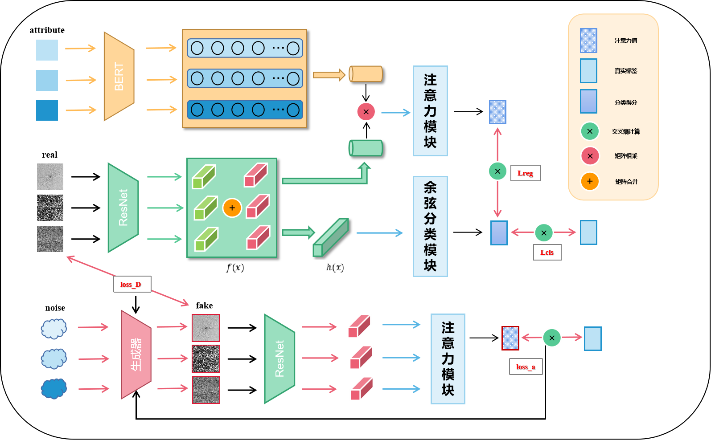

# Industry Zero-shot Learning and Few-shot Learning

## 📌 Project Overview
This project focuses on zero-shot and few-shot learning techniques in industrial applications. It includes dataset processing, feature extraction, and deep learning model training.

## 🖼️ Framework
Below is the framework of our project:



## 🚀 Usage
To run the model with the specified parameters, use the following command:

```bash
python main.py --DataName MSD --embeddingWay BERT --shot 1 --nclass_all 20 --nclass_seen 15 \
--nepoch 800 --g_epoch 50 --syn_num 8 --batch_size 32 --g_size 16 --imgSize 224 --embedSize 1024 \
--reg_lamd 3.5 --lr 0.0002 --manualSeed 3483 --gpus 0
```

## 📂 Project Structure
```
📁 Industry4
 ├── 📁 dataset
 ├── 📁 feature&att
 ├── 📁 resnet18
 ├── 📁 source
 ├── 📄 framework.png  <- This is the framework image
 ├── 📄 README.md  <- This README file
```

## 📜 License
This project is licensed under the MIT License.

